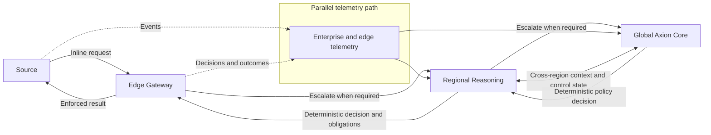

# Distributed Reasoning Architecture

## Status and Intent

This note documents the current Axion architecture direction as a design exploration. It does not select a final implementation, cloud platform, model topology, latency target, or deployment scale.

## Current Direction

Axion is being considered as a **distributed AI security fabric with a centralized control and decision model**. Enforcement and selected reasoning capabilities would be placed near sources, while policy semantics, identity relationships, trust state, and cross-domain coordination would remain governed through a common model.

Centralization in this context is logical rather than physical. It does not imply one global service on every synchronous path. The intent is to avoid inconsistent authority while allowing enforcement, telemetry processing, caching, and reasoning to operate at the location appropriate to each use case.

The proposed hierarchy has three levels:

1. **Edge gateways close to the source** mediate inline requests, collect local telemetry, validate structured actions, consult deterministic policy, and enforce decisions.
2. **Regional reasoning tiers** correlate activity within a geographic or organizational boundary, provide additional context, and handle work that exceeds edge capability or context.
3. **Global Axion Core** maintains the global control model, coordinates cross-region context and policy, and handles escalations that require enterprise-wide evidence or governance.

This hierarchy is not assumed to map one-to-one to model instances. A tier may perform deterministic processing only, call a hosted model, host a model, or avoid model reasoning entirely for a particular decision.

## Design Principle

> Reason as close to the source as necessary, but no closer than justified by latency, cost, privacy, and context requirements.

Local placement can reduce latency and data movement, but it also expands the model and operational footprint. Central placement can improve context and governance, but may add latency, concentration risk, cross-border data movement, and dependency on network availability. Placement should therefore follow measured requirements rather than a default preference for either edge or central inference.

## Logical Planes

The architecture separates four logical planes. Implementations may combine components, but the responsibilities and trust implications should remain distinguishable.

### Enforcement Plane

The Enforcement Plane is on the authoritative action path. It authenticates actors and workloads, validates requests, obtains deterministic authorization decisions, applies policy obligations, brokers credentials and capabilities, and prevents unapproved execution. Edge gateways are the primary enforcement location, while target systems retain their own domain authorization.

### Telemetry Plane

The Telemetry Plane collects, classifies, transports, and correlates observations from gateways and enterprise systems. It supports both near-real-time analysis and longer-horizon investigation. Telemetry may contain sensitive payloads, identities, and behavioral data; minimization, integrity, residency, access, and retention controls apply.

### Reasoning Plane

The Reasoning Plane interprets intent, correlates evidence, identifies uncertainty, proposes classifications, and recommends actions. It may be distributed across edge, regional, and global tiers. Its outputs are advisory inputs to policy and orchestration. They do not authorize actions or silently expand privileges.

### Control Plane

The Control Plane governs identity and trust relationships, policy, capability registrations, reputation sources, cache rules, model routing, revocation state, approval requirements, and configuration distribution. Changes to this plane can alter future authority and require strong administrative controls, versioning, separation of duties, and audit.

## Data Flows

### Inline Flow

1. A source sends an action request to its nearest appropriate edge gateway.
2. The gateway authenticates the initiating actor, agent, and workload and validates the requested capability and parameters.
3. The gateway checks locally available deterministic policy and decision-cache state.
4. If the decision can be made within the local authority and confidence envelope, the gateway enforces it.
5. Otherwise, the request is escalated to regional reasoning and, when necessary, to the global core for additional context or coordination.
6. A deterministic policy decision returns to the edge with its reason, obligations, version, and validity.
7. The edge enforces the decision and records the invocation and result.

Reasoning may inform the structured facts or recommended handling. The final allow or deny result remains deterministic and enforceable at the edge or target.

### Out-of-Path Flow

1. Edge gateways and enterprise systems publish permitted telemetry to regional collection and reasoning services.
2. Regional services correlate events under applicable residency and retention constraints.
3. Events requiring cross-region or enterprise-wide context are summarized, referenced, or escalated to the global core according to policy.
4. Regional or global reasoning proposes a response, investigation, or policy-relevant classification.
5. Any response with external effect returns through the deterministic policy and enforcement path. Out-of-path reasoning does not become an alternate execution channel.

## Local Decision Cache

An edge gateway may maintain a bounded local decision cache to reduce synchronous dependency and latency. Candidate entries include:

- content or artifact hashes;
- signed reputation data;
- recent verdicts;
- deterministic, policy-aware allow or deny decisions.

The cache is not a source of new authority. Each entry must be bound to the policy-relevant identity, delegation, capability, resource, context, policy version, and expiry as applicable. A verdict for one actor, tenant, region, or action must not be generalized unless policy explicitly permits that reuse.

Allow entries require particular care because stale permission can preserve revoked access. Deny entries can also cause material availability impact. Cache behavior therefore needs explicit maximum age, provenance, integrity protection, invalidation, revocation handling, negative-cache policy, and observability.

## Capability-Specific Latency Model

Axion should not treat “AI latency” as one homogeneous budget. A general-purpose reasoning model is unlikely to return a useful, structured risk assessment within a hard 150 ms end-to-end deadline once network transit, queueing, context assembly, inference, parsing, and deterministic arbitration are included. First-token latency is not equivalent to a completed decision contribution.

A 150 ms target may be appropriate as a **fast-path decision service-level objective for selected capabilities**. It should not be described as the general AI deadline. Heavyweight reasoning may contribute when it completes within the applicable window, but safe fast-path enforcement must not depend on it.

Different work belongs in different approximate timing bands:

| Illustrative elapsed time | Candidate work |
|---|---|
| 0–10 ms | Local cache lookup, signature validation, hard policy evaluation, and locally available revocation checks |
| 10–50 ms | Enterprise Capability Graph lookup, behavioral feature retrieval, and lightweight deterministic or statistical scoring |
| 50–250 ms | Compact or specialized local or regional models, where justified and available |
| 250 ms–2 s | Richer regional reasoning and multi-source correlation |
| Seconds or longer | Deep correlation, global reasoning, investigation, simulation, and human review |

These ranges are hypotheses for architecture and testing, not performance commitments. Deployment topology, provider behavior, workload, context size, arbitration, and network conditions may change them materially.

The permitted decision budget belongs to the capability and policy, not to Axion as one global setting. For example, `sharepoint.read.document` might use a 30 ms fast-path budget with a short-lived constrained allow, while `entra.assign.global-admin` might permit two seconds of required reasoning and still require another control such as step-up authentication, separation of duties, or human approval.

Capability-specific policy should define:

- the fast-path decision SLO;
- which deterministic and reasoning inputs are required within that path;
- whether asynchronous reasoning may continue after an initial decision;
- the scope, lifetime, and reversibility of any initial authority;
- the maximum time before a later decision must be enforced; and
- behavior when each required tier is late or unavailable.

This model allows fast local enforcement for bounded actions without forcing every reasoning task into an unrealistic synchronous deadline.

## Escalation Model

Requests escalate **edge → regional → global** when local handling lacks sufficient authority or context. Escalation criteria may include:

- **uncertainty:** the available evidence or classification is insufficient for the permitted local decision envelope;
- **impact:** the proposed action exceeds local risk, financial, data, or operational thresholds;
- **context:** a decision requires regional history, cross-system correlation, or enterprise-wide state; and
- **latency requirements:** the request can tolerate escalation, or conversely requires a predefined local fail behavior when escalation cannot complete in time.

Escalation is not a mechanism for seeking a more permissive answer. Higher tiers may add context, require stronger obligations, or determine that the action cannot proceed. The deterministic policy model must define which tier is authoritative for each decision class and how contradictory or stale state is handled.

Escalation need not block completion of every low-risk request. Where capability policy permits it, the edge may issue an initial constrained decision while regional or global reasoning continues asynchronously. A later result can tighten future decisions or revoke unused authority, but it cannot make an irreversible completed effect safe after the fact.

## Conceptual Architecture

The diagram shows logical flow, not required network hops. A locally authorized request need not traverse the regional or global tier. A global decision may also be distributed in advance as signed policy or bounded cache state rather than requested synchronously.

## Cloud Portability

Google Cloud Platform (GCP) is a possible reference implementation because it could provide concrete services against which to test identity, regionality, messaging, policy, model hosting, and operational assumptions. No GCP service is currently an architectural requirement.

The logical planes and contracts should remain cloud-neutral and portable to Amazon Web Services, Microsoft Azure, and sovereign cloud environments. Portability does not require identical managed services. It requires that identity, policy evaluation, telemetry, reasoning, credential brokering, revocation, and enforcement responsibilities have documented interfaces and security properties independent of a provider.

Multi-cloud portability may introduce a least-common-denominator design, inconsistent identity semantics, or greater operational cost. These trade-offs should be measured in any reference implementation rather than assumed away.

## Current Decisions

- Final authorization is deterministic and outside model reasoning.
- Enforcement remains on the authoritative action path at the edge and/or target.
- The control and decision model is logically centralized even when runtime components are distributed.
- Regional and global reasoning outputs are advisory until evaluated by deterministic policy.
- Out-of-path analysis cannot bypass the inline enforcement path when initiating a response.
- Failure must reduce capability rather than introduce broader or unmediated access.

## Working Assumptions

- Edge gateways can obtain strong workload identity and authenticated policy state.
- Many routine decisions can be made from bounded local policy and cache context.
- Regional tiers provide a useful boundary for data residency, latency, and operational ownership.
- Some threats and autonomous activities require cross-region correlation.
- Policies and revocation signals can be distributed with measurable freshness and integrity.
- Use cases can define a maximum decision latency and an explicit failure behavior.

These assumptions require validation. If one does not hold for a deployment, the topology or permitted use cases may need to change.

## Unresolved Questions

### Edge model requirement

- Do edge gateways ever need local models, or can they rely on deterministic processing and regional model access?
- If local models are justified, what isolation, update, provenance, and resource controls are required?

### Decision latency

- What decision latency is required for API calls, interactive agents, CI/CD controls, incident response, and long-running automation?
- Which actions may wait for regional or global reasoning, and which must use a bounded local decision or deny?
- Which capabilities justify a fast-path decision SLO near 150 ms, and what work can reliably complete inside it?
- How should end-to-end budgets account for context assembly, inference, parsing, arbitration, and enforcement rather than only model response time?

### Cache invalidation and revocation

- How are policy, reputation, identity, capability, and delegation changes propagated?
- What maximum stale interval is acceptable for allow and deny entries at each risk tier?
- Can high-risk allows ever be cached?

### Regional data residency

- Which raw events, derived features, prompts, and decision evidence may leave a region?
- Can global correlation operate on references or privacy-preserving summaries without losing necessary context?

### Cross-region correlation

- Which events justify enterprise-wide correlation?
- How are clock skew, duplicate identities, inconsistent schemas, partial evidence, and conflicting regional policy handled?

### Model placement and sizing

- Which reasoning tasks require a model, and what capability is sufficient for each?
- Should models be pooled regionally, hosted globally, supplied by external platforms, or deployed locally for specific classifications?
- How are cost, latency, privacy, availability, and model-change risk balanced?

### Regional or global unavailability

- Which local decisions may continue when regional or global reasoning is unavailable?
- How long may cached state remain usable, and which actions must immediately deny or pause?
- How are queued escalations, partial workflows, recovery, and post-outage reconciliation handled?
- Can emergency operation remain narrow, pre-authorized, time-bound, and fully attributable?

## Evaluation Criteria

Before this direction is treated as an implementation architecture, it should be tested against representative use cases for decision latency, enforcement coverage, data movement, policy and revocation freshness, cache correctness, regional isolation, correlated detection value, failure behavior, operating cost, and recovery complexity.
