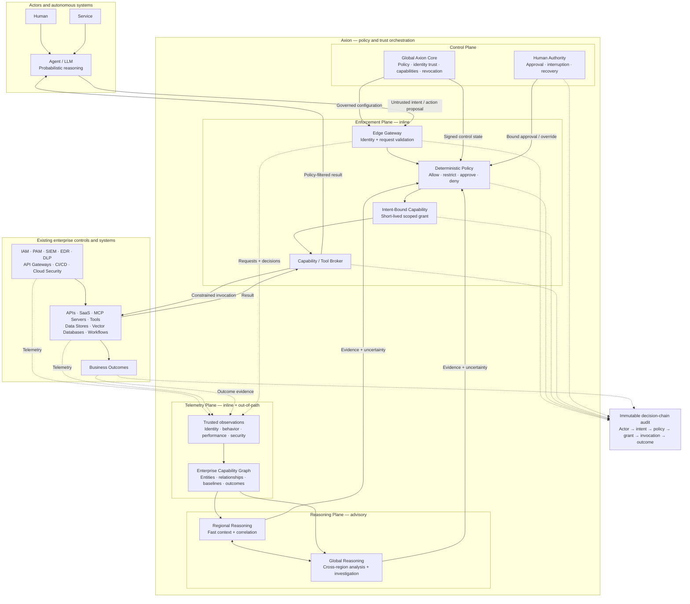

# Axion Overall Architecture

This overview shows how Axion combines distributed observation and reasoning with deterministic authorization and enforcement. It is intended as a concise discussion aid; the repository's design notes define the qualifications and unresolved questions behind each component.

## Reading the Diagram

- Models and reasoning engines interpret intent and evidence; their outputs remain advisory.
- Deterministic policy authorizes, constrains, or denies actions at the inline enforcement boundary.
- Axion Capability Grants bind approved business intent to a short-lived execution context.
- The Enterprise Capability Graph combines inline observations with telemetry from systems that Axion does not mediate directly.
- Edge, regional, and global components distribute latency and context without creating different authorization semantics.
- Existing enterprise products retain their domain responsibilities; Axion coordinates them rather than replacing them.
- The audit chain connects the initiating actor to the resulting business outcome.

The most important boundary is the transition from an untrusted action proposal to deterministic authorization. Failure or delay in AI reasoning may reduce capability, but it must not disable enforcement or create authority.
